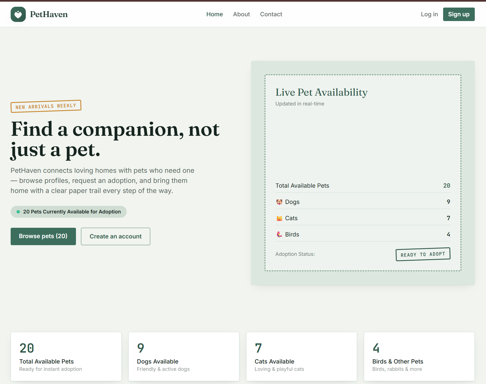
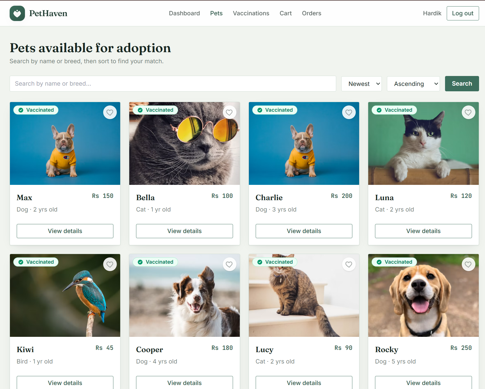
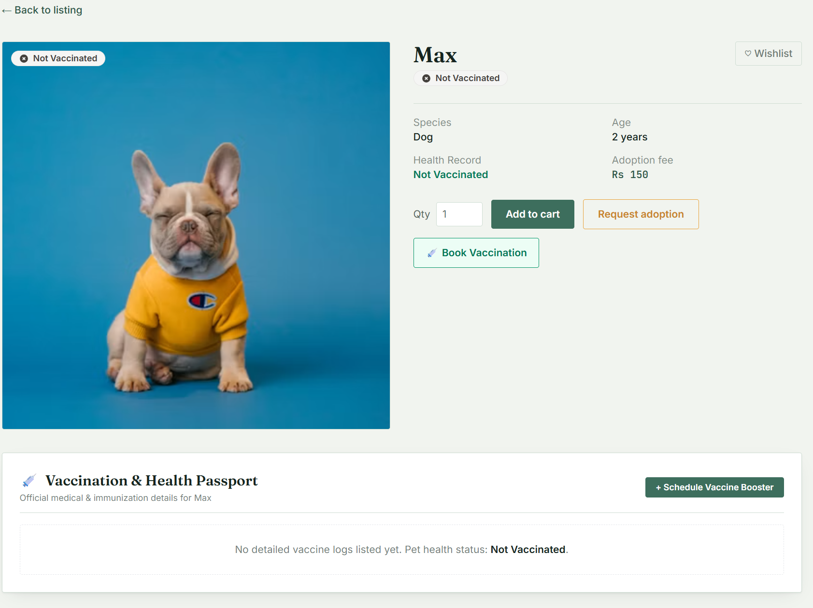
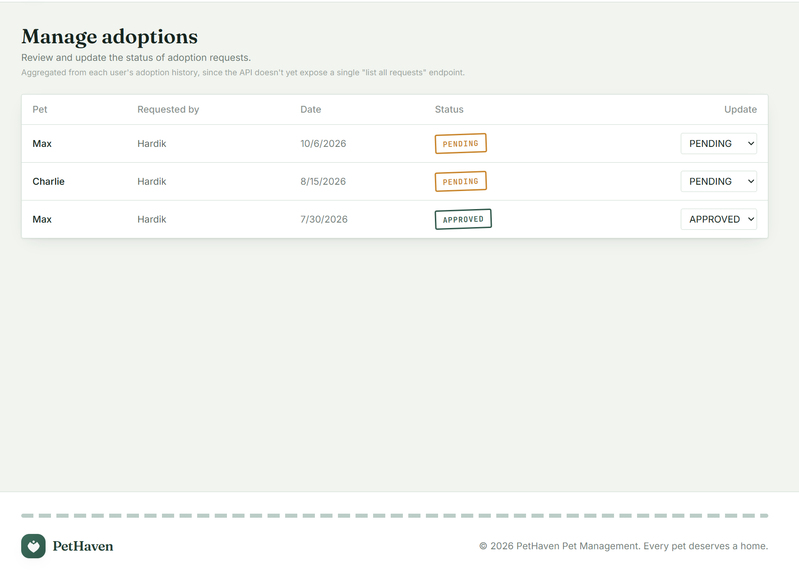
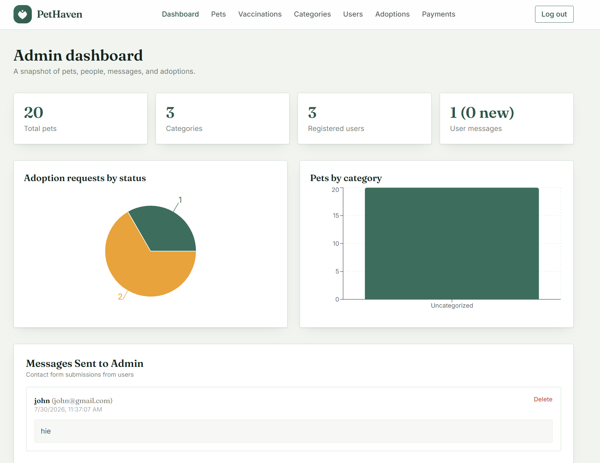
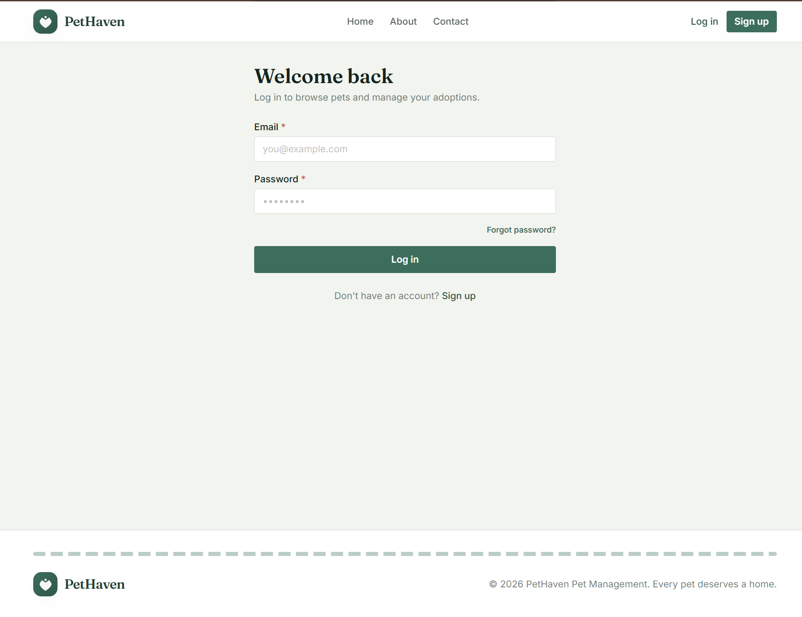
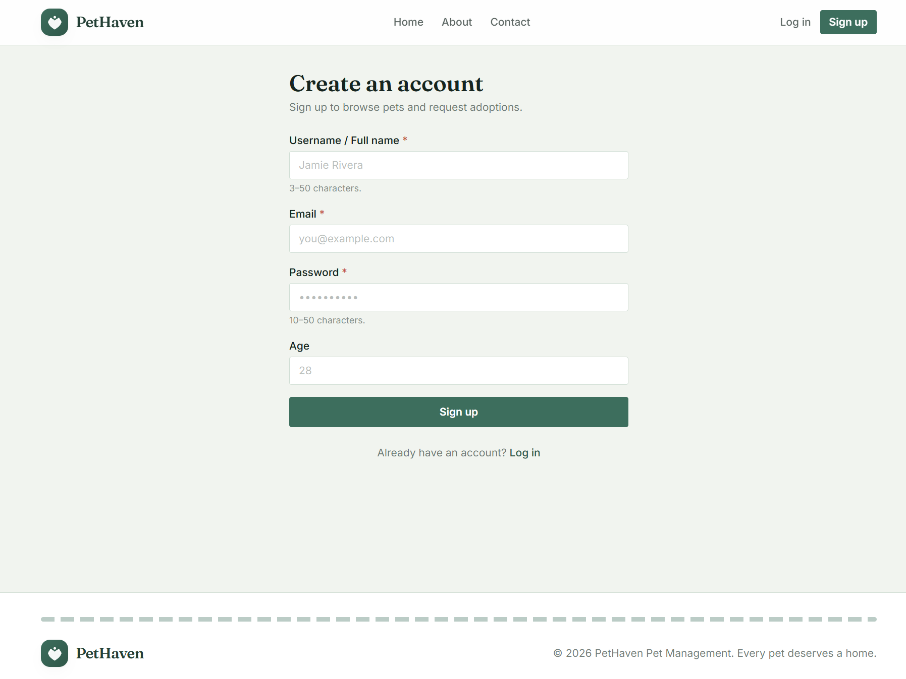
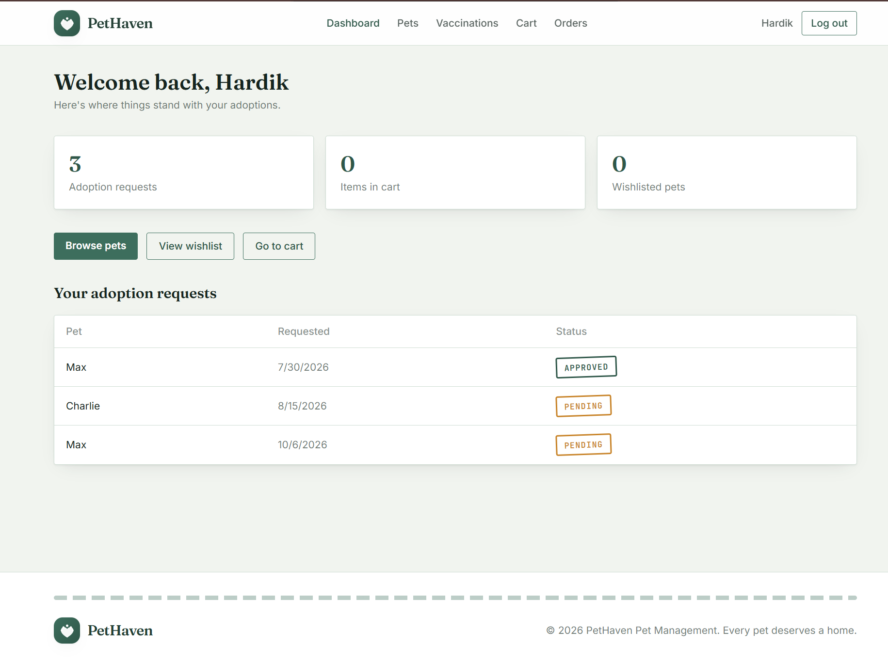
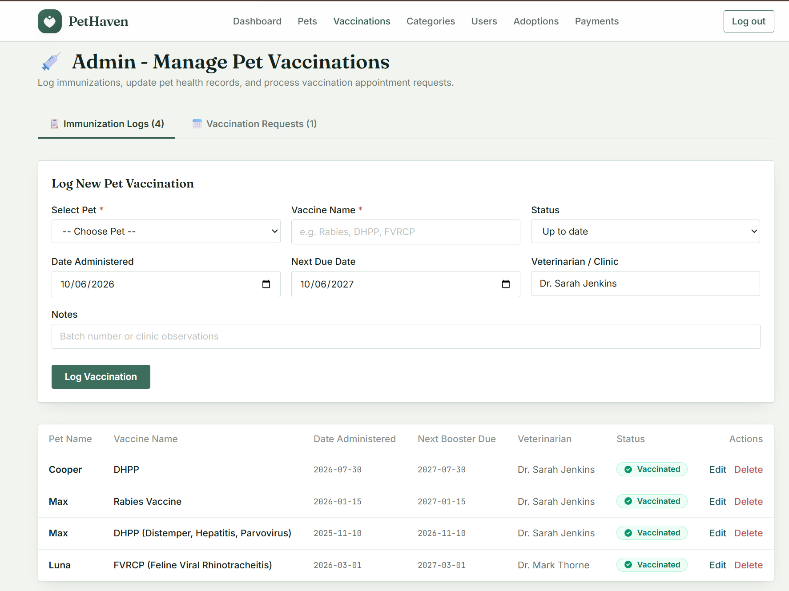

# 🐾 Pet Adoption & Care Management System

A full-stack web application designed to simplify the process of pet adoption and pet care management. The system allows users to browse available pets, submit adoption requests, manage pet-related information, and access various pet-care services through a user-friendly interface.


---

## 📌 Project Overview

The Pet Adoption & Care Management System** provides a centralized platform connecting people who want to adopt pets with shelters and administrators.

The application manages the complete adoption workflow, from viewing available pets and submitting adoption requests to maintaining pet medical records and managing users.

It also provides an **Admin Dashboard** for managing pets, users, adoption requests, categories, and other system activities.

---

## 🎯 Objectives

* 🐶 Provide an easy platform for pet adoption.
* 🏠 Help shelters manage pets efficiently.
* ❤️ Allow users to browse and adopt pets.
* 📋 Manage adoption requests digitally.
* 💉 Maintain vaccination and medical records.
* 📅 Manage veterinary appointments.
* 🔐 Provide secure authentication and authorization.
* 📊 Provide administrators with a centralized dashboard.
* 📧 Support email notifications for important activities.

---

## ✨ Features

### 👤 User Features

* User registration and login
* Secure JWT authentication
* Browse available pets
* Search and filter pets
* View pet details
* Add pets to cart
* Submit adoption requests
* Track adoption request status
* View adoption history
* Manage profile information
* Receive email notifications

### 🏥 Pet Care Features

* Pet medical records
* Vaccination information
* Veterinary appointment scheduling
* Pet health information
* Care history management

### 🏠 Shelter Features

* Add and manage pets
* Update pet information
* Manage adoption requests
* View adopted pets
* Manage pet categories

### 👨‍💼 Admin Features

* Admin dashboard
* Manage users
* Manage pets
* Manage shelters
* Manage veterinarians
* Manage categories
* Manage adoption requests
* Manage medical/vaccination records
* Monitor system activities

---

## 🛠️ Technologies Used

### Backend

* Java
* Spring Boot
* Spring Security
* JWT Authentication
* Spring Data JPA
* Hibernate
* REST APIs
* Maven

### Frontend

* React.js
* JavaScript
* HTML5
* CSS3
* Axios
* React Router

### Database

* MySQL

### Development Tools

* IntelliJ IDEA / Eclipse
* Visual Studio Code
* MySQL Workbench
* Postman
* Git & GitHub

---

## 🏗️ System Architecture

```text
                    ┌─────────────────────────┐
                    │       React.js          │
                    │       Frontend          │
                    └────────────┬────────────┘
                                 │
                              Axios
                                 │
                                 ▼
                    ┌─────────────────────────┐
                    │     Spring Boot         │
                    │      REST APIs          │
                    └────────────┬────────────┘
                                 │
                    ┌────────────┴────────────┐
                    │                         │
                    ▼                         ▼
           ┌─────────────────┐      ┌─────────────────┐
           │ Spring Security │      │ Spring Data JPA │
           │      + JWT      │      │    + Hibernate  │
           └─────────────────┘      └────────┬────────┘
                                             │
                                             ▼
                                  ┌──────────────────┐
                                  │      MySQL       │
                                  │     Database     │
                                  └──────────────────┘
```

---

## 📂 Project Structure

### Backend

```text
PetManagementSystem/
│
├── src/
│   ├── main/
│   │   ├── java/
│   │   │   └── com/
│   │   │       └── pms/
│   │   │           └── PetManagementSystem/
│   │   │               │
│   │   │               ├── config/
│   │   │               ├── controller/
│   │   │               ├── dto/
│   │   │               ├── entity/
│   │   │               ├── repository/
│   │   │               ├── security/
│   │   │               ├── service/
│   │   │               └── PetManagementSystemApplication.java
│   │   │
│   │   └── resources/
│   │       └── application.properties
│   │
│   └── test/
│
├── pom.xml
└── README.md
```

### Frontend

```text
PetManagementSystem-frontend/
│
├── src/
│   ├── components/
│   ├── pages/
│   ├── services/
│   ├── context/
│   ├── assets/
│   ├── App.jsx
│   ├── main.jsx
│   └── App.css
│
├── public/
├── package.json
├── vite.config.js
└── README.md
```

---

## 🔐 Authentication & Authorization

The application uses Spring Security and JWT for secure authentication.

### Authentication Flow

```text
User
  │
  ▼
Login
  │
  ▼
Spring Security
  │
  ▼
Validate Credentials
  │
  ▼
Generate JWT Token
  │
  ▼
Frontend Stores Token
  │
  ▼
Token Sent With API Requests
  │
  ▼
JWT Filter Validates Token
  │
  ▼
Access Protected API
```

Different roles can be provided based on system requirements:

```text
USER
SHELTER
VETERINARIAN
ADMIN
```

---

## 🗄️ Main Database Entities

The system can contain entities such as:

* User
* Pet
* Category
* AdoptionRequest
* Cart
* Payment
* MedicalRecord
* Vaccination
* Appointment
* Shelter
* Veterinarian

### Basic Relationship

```text
User
 │
 ├── Adoption Requests
 │
 ├── Cart
 │
 └── Adoption History

Pet
 │
 ├── Category
 ├── Medical Records
 ├── Vaccinations
 ├── Appointments
 └── Adoption Request

Shelter
 │
 └── Pets

Veterinarian
 │
 ├── Appointments
 └── Medical Records
```

---

## 🔄 Adoption Workflow

```text
        User Registration
                │
                ▼
            User Login
                │
                ▼
          Browse Pets
                │
                ▼
          Select a Pet
                │
                ▼
        Submit Adoption
             Request
                │
                ▼
       Admin/Shelter Review
                │
          ┌─────┴─────┐
          │           │
        Approve      Reject
          │           │
          ▼           ▼
      Adoption      Request
      Completed     Rejected
```

---

## 🚀 Installation & Setup

### 1. Clone the Repository

```bash
git clone https://github.com/your-username/Pet-Adoption-Care-Management-System.git
```

```bash
cd Pet-Adoption-Care-Management-System
```

---

### 2. Backend Setup

Open the backend project in **IntelliJ IDEA or Eclipse**.

Configure the MySQL database in:

```text
src/main/resources/application.properties
```

Example:

```properties
spring.datasource.url=jdbc:mysql://localhost:3306/pet_management?createDatabaseIfNotExist=true&useSSL=false&allowPublicKeyRetrieval=true&serverTimezone=UTC
spring.datasource.username=root
spring.datasource.password=YOUR_PASSWORD

spring.jpa.hibernate.ddl-auto=update
spring.jpa.show-sql=true

server.port=8080
```

Then run:

```bash
mvn spring-boot:run
```

Backend will run on:

```text
http://localhost:8080
```

---

### 3. Frontend Setup

Open the frontend folder:

```bash
cd PetManagementSystem-frontend
```

Install dependencies:

```bash
npm install
```

Start the React application:

```bash
npm run dev
```

The frontend will normally run on:

```text
http://localhost:5173
```

---

## 🔌 API Examples

### Pet APIs
* **GET** `/pet/fetchall` - Get all pets
* **POST** `/pet/savepets` - Add a new pet

### Adoption API
* **POST** `/api/adoption/request` - Submit an adoption request

### Cart API
* **POST** `/cart/addtocart` - Add a pet to cart

> *Note: API endpoints may vary depending on the current backend implementation.*

---

## 🧪 Testing

The REST APIs can be tested using Postman.

**Example Login Request:**

`POST http://localhost:8080/api/auth/login`

```json
{
  "email": "user@example.com",
  "password": "password"
}
```

After successful login, use the returned JWT token for protected APIs:

```http
Authorization: Bearer <JWT_TOKEN>
```

---

## 📸 Screenshots

### Home Page


### Pet Listing


### Pet Details


### Adoption Request


### Admin Dashboard


### Login


### Register


### User Dashboard


### Medical Records


---

## 🔮 Future Enhancements

* 🤖 AI-based pet recommendation
* 📍 Location-based pet search
* 💳 Online payment integration
* 📱 Mobile application
* 🔔 Real-time notifications
* 🩺 Advanced veterinary management
* 📊 Advanced analytics dashboard
* 🐕 AI-based pet matching
* ☁️ Cloud deployment
* 📷 Improved pet image management

---

## 🎓 Project Details

* **Project Type:** Academic
* **Domain:** Pet Adoption & Pet Care Management
* **Application Type:** Full-Stack Web Application

---

## 📄 License

This project is developed for educational and academic purposes.

---

## ⭐ Support

If you find this project useful, consider giving the repository a ⭐ on GitHub.

🐾 Made with ❤️ for Pet Adoption & Care
```
